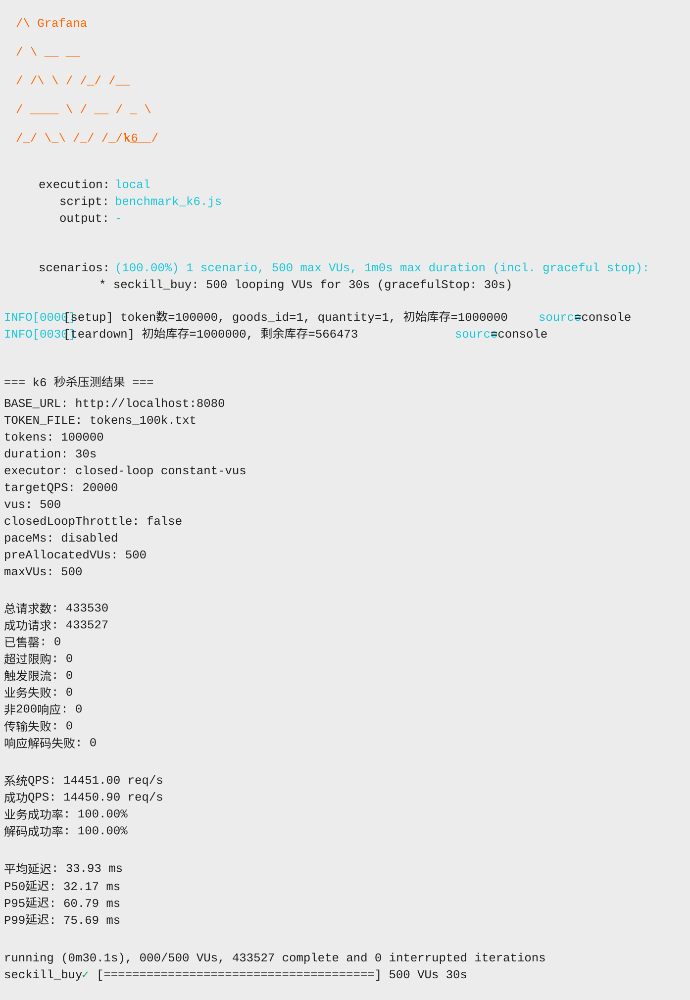

# 高并发秒杀系统

一个基于 Go + Vue 3 的高并发秒杀系统，采用 Redis + Kafka + MySQL 架构，实现了异步削峰、超时自动取消等核心功能。

## 性能指标

在 **Mac Mini M4** 本地环境（Docker 部署）下，基于 `k6` 闭环 `constant-vus` 模型（`500 VUs`、`30s`、`100000` 个 token）的压测结果：

- **系统QPS**: 14,451.00 req/s
- **成功QPS**: 14,450.90 req/s
- **平均延迟**: 33.93 ms
- **P95延迟**: 60.79 ms
- **P99延迟**: 75.69 ms
- **业务成功率**: 100%
- **总请求数**: 433,530 次

## 技术栈

### 后端
- **Go 1.24** - 高性能 Web 服务
- **Gin** - HTTP 框架
- **GORM** - ORM 框架
- **MySQL 8.0** - 持久化存储
- **Redis 7** - 缓存 + 分布式锁 + 延迟队列
- **Kafka** - 消息队列（异步削峰）
- **JWT** - 用户认证

### 前端
- **Vue 3** - 渐进式框架
- **Vue Router** - 路由管理
- **Axios** - HTTP 客户端
- **Vite** - 构建工具

### 基础设施
- **Docker Compose** - 容器编排
- **Nginx** - 前端静态资源服务

## 核心特性

### 1. 异步削峰 (Async Peak Clipping)
- Redis 快速校验 + 扣减库存
- Kafka 异步落库（64 分区并行消费）
- 批量写入 MySQL（1000 条/批）

### 2. 限购控制 (Purchase Limit)
- Redis Bitmap 记录用户购买记录
- 支持配置每用户每商品最大购买数量
- Lua 脚本原子性检查 + 扣减

### 3. 订单超时自动取消
- **Redis 延迟队列**: ZSET 实现，500ms 扫描间隔
- **MySQL 兜底扫描**: 5 分钟扫描间隔
- 超时订单自动取消 + 库存返还

### 4. 分布式 ID
- 雪花算法生成订单 ID
- 支持 1024 个工作节点
- 毫秒级时间戳 + 序列号

### 5. 高性能优化
- **Kafka 批量发送**: 1000 条/批，5ms 超时
- **Kafka 批量消费**: 2000 条/次，50ms 超时
- **MySQL 批量写入**: 1000 条/批，50ms 刷新
- **连接池优化**: MySQL 2000 连接，Redis 2000 连接

## 系统架构

```
┌─────────┐      ┌─────────┐      ┌─────────┐
│ 前端    │─────▶│ Nginx   │─────▶│ Backend │
│ Vue 3   │      │         │      │ (Gin)   │
└─────────┘      └─────────┘      └────┬────┘
                                        │
                    ┌───────────────────┼───────────────────┐
                    ▼                   ▼                   ▼
              ┌─────────┐         ┌─────────┐        ┌─────────┐
              │ Redis   │         │ Kafka   │        │ MySQL   │
              │ 库存    │         │ 消息队列│        │ 持久化  │
              │ 分布式锁│         │ 64分区  │        │         │
              │ 延迟队列│         └────┬────┘        └─────────┘
              └─────────┘              │
                                       ▼
                                 ┌─────────┐
                                 │ Worker  │
                                 │ 消费者  │
                                 │ 批量写入│
                                 └─────────┘
```

## 快速开始

### 前置要求
- Docker & Docker Compose
- Go 1.24+ (仅 `make up` 本机构建模式需要)
- Node.js 18+ (本地开发)

### 环境变量（可选）
如需外置敏感配置，可先创建环境变量文件：
```bash
cp .env.example .env
```
`docker compose` 会自动读取项目根目录 `.env`。

### 一键启动

默认 Docker 部署会在镜像构建阶段编译后端，不需要先在本机生成二进制文件：

```bash
# 克隆项目
git clone <repository-url>
cd seckill

# 启动所有服务
docker compose up -d --build

# 查看日志
docker compose logs -f
```

如果希望先在本机构建后端二进制，再把产物复制进 Docker 镜像，使用：

```bash
make up
```

Windows PowerShell 没有 `make` 时，可手动执行等价命令：

```powershell
cd backend
.\bin\build-linux.ps1
cd ..
docker compose -f docker-compose.yml -f docker-compose.local-build.yml up -d --build
```

服务地址：
- 前端: http://localhost
- 后端 API: http://localhost:18080
- MySQL: localhost:13306
- Redis: localhost:16379
- Kafka: localhost:19092

### 本地开发

#### 后端开发
```bash
cd backend

# 安装依赖
go mod download

# 启动 API 服务
go run cmd/api/main.go

# 启动 Worker 服务
go run cmd/worker/main.go
```

#### 前端开发
```bash
cd frontend

# 安装依赖
npm install

# 启动开发服务器
npm run dev

# 构建生产版本
npm run build
```

## 使用指南

### 1. 注册用户
```bash
curl -X POST http://localhost:18080/api/auth/register \
  -H "Content-Type: application/json" \
  -d '{"username":"user1","password":"123456"}'
```

### 2. 登录获取 Token
```bash
curl -X POST http://localhost:18080/api/auth/login \
  -H "Content-Type: application/json" \
  -d '{"username":"user1","password":"123456"}'
```

### 3. 预热库存
```bash
ADMIN_TOKEN=$(curl -s -X POST http://localhost:18080/api/admin/login \
  -H "Content-Type: application/json" \
  -d '{"username":"<admin-username>","password":"<admin-password>"}' | jq -r '.data.token')

curl -X POST http://localhost:18080/api/admin/warmup \
  -H "Authorization: Bearer ${ADMIN_TOKEN}"
```

### 4. 参与秒杀
```bash
curl -X POST http://localhost:18080/api/seckill/buy \
  -H "Content-Type: application/json" \
  -H "Authorization: Bearer <your-token>" \
  -d '{"goods_id":1,"quantity":1}'
```

### 5. 查询订单
```bash
curl http://localhost:18080/api/orders \
  -H "Authorization: Bearer <your-token>"
```

## 压力测试

### 准备测试数据

```bash
cd test/tools

# 生成 10 万个测试用户
go run ./setup_users

# 生成 10 万个 Token
go run ./gen_tokens
```

### 使用 k6 压测

```bash
cd test

# benchmark_k6.js 会优先读取 ../.env，其次读取当前目录 .env
# 显式传入的环境变量优先级更高
# 默认使用更接近 benchmark.go 的闭环模型：固定 VU，不主动节流
k6 run benchmark_k6.js
```

覆盖默认参数示例：

```bash
cd test

TOKEN_FILE=tokens_100k.txt \
GOODS_ID=1 \
TARGET_QPS=20000 \
DURATION=30 \
VUS=500 \
k6 run benchmark_k6.js
```

如果你想在闭环模式下也按目标 QPS 主动节流：

```bash
cd test

CLOSED_LOOP_THROTTLE=true \
TARGET_QPS=20000 \
VUS=500 \
k6 run benchmark_k6.js
```

如果你明确要做开放模型压测，再切到 arrival-rate：

```bash
cd test

EXECUTOR_MODE=arrival-rate \
TARGET_QPS=20000 \
PREALLOCATED_VUS=500 \
MAX_VUS=20000 \
k6 run benchmark_k6.js
```

常用环境变量：

- `BASE_URL`: 默认 `http://localhost:18080`
- `ADMIN_USERNAME` / `ADMIN_PASSWORD`: 必填，压测前用于登录后台并调用预热接口
- `TOKEN_FILE`: 默认 `tokens_100k.txt`
- `GOODS_ID`: 默认 `1`
- `QUANTITY`: 默认 `1`
- `EXECUTOR_MODE`: 默认 `closed-loop`，可选 `arrival-rate`
- `TARGET_QPS`: 默认 `20000`；在 `arrival-rate` 下用于恒定到达率，在闭环限速开启时用于计算 pacing
- `DURATION`: 默认 `30`
- `VUS`: 闭环模式默认 `500`
- `CLOSED_LOOP_THROTTLE`: 默认 `false`；设为 `true` 时，闭环模式会按目标 QPS 主动节流
- `PACE_MS`: 闭环限速开启时单个 VU 的节流间隔，默认按 `VUS / TARGET_QPS` 自动计算
- `PREALLOCATED_VUS`: `arrival-rate` 模式默认 `500`
- `MAX_VUS`: 默认 `max(PREALLOCATED_VUS, TARGET_QPS)`
- `MAX_USERS`: 默认 `100000`

说明：

- `benchmark_k6.js` 是当前默认压测入口，主要覆盖 HTTP 压测、业务码统计和库存预热。
- 默认会自动加载项目根目录 `.env`，方便读取 `ADMIN_USERNAME`、`ADMIN_PASSWORD`、`BASE_URL` 等配置。
- 每次执行会在 `test/` 目录生成 `benchmark_k6_<timestamp>.html` 和 `benchmark_k6_<timestamp>.json`。
- `benchmark.go` 已保留为历史 Go 脚本，仅作参考，不再作为默认压测方案。

### 最新 k6 压测结果 (2026-03-13)



## 配置说明

主要配置文件: `backend/configs/config.yaml`

### 启动安全配置（推荐）
```yaml
startup:
  flush_redis_on_start: false  # 默认 false，避免重启时误清空 Redis
```

### Redis 配置
```yaml
redis:
  addr: 127.0.0.1:6379
  pool_size: 2000
```

### 环境变量覆盖（推荐生产环境）

程序会优先读取环境变量覆盖配置文件中的敏感项，常用变量如下：

- `MYSQL_HOST` `MYSQL_PORT` `MYSQL_DATABASE` `MYSQL_USER` `MYSQL_PASSWORD`
- `REDIS_ADDR` `REDIS_DB`
- `KAFKA_BROKERS`（逗号分隔）`KAFKA_TOPIC` `KAFKA_GROUP`
- `JWT_SECRET` `JWT_EXPIRE_HOURS`
- `ADMIN_USERNAME` `ADMIN_PASSWORD`
- `SERVER_PORT`
- `STARTUP_FLUSH_REDIS_ON_START`

注意：
- `JWT_SECRET`、`ADMIN_USERNAME` 和 `ADMIN_PASSWORD` 为必填项，程序启动时会强制校验。
- 这些字段不会再从 `config.yaml`/`config.docker.yaml` 读取，必须由环境变量提供（建议放在项目根目录 `.env`）。

示例：
```bash
export MYSQL_PASSWORD='strong-password'
export JWT_SECRET='base64-or-random-secret'
export ADMIN_USERNAME='admin'
export ADMIN_PASSWORD='strong-admin-password'
export STARTUP_FLUSH_REDIS_ON_START=false
```

### Kafka 配置
```yaml
kafka:
  brokers:
    - 127.0.0.1:19092
  producer:
    batch_size: 1000
    batch_timeout_ms: 5
    sender_count: 100
  consumer:
    consumer_count: 64
    batch_size: 1000
    batch_flush_ms: 50
```

### 超时配置
```yaml
timeout:
  order_timeout_seconds: 60
  redis_scan_interval: "500ms"
  mysql_scan_interval: "5m"
```

## 数据库设计

### 订单表 (orders)
```sql
CREATE TABLE orders (
    id BIGINT UNSIGNED NOT NULL COMMENT '订单ID(雪花算法)',
    user_id BIGINT UNSIGNED NOT NULL,
    goods_id BIGINT UNSIGNED NOT NULL,
    quantity INT UNSIGNED NOT NULL,
    pay_amount DECIMAL(10, 2) NOT NULL,
    status TINYINT UNSIGNED NOT NULL DEFAULT 0,
    request_time DATETIME(3) NOT NULL,
    create_time DATETIME(3) NOT NULL,
    born_time DATETIME(3) NOT NULL,
    store_time DATETIME(3) NOT NULL,
    write_time DATETIME(3) NOT NULL,
    PRIMARY KEY (id),
    INDEX idx_user_id (user_id),
    INDEX idx_status_write_time (status, write_time)
) ENGINE=InnoDB;
```

### 商品表 (goods)
```sql
CREATE TABLE goods (
    id BIGINT UNSIGNED NOT NULL AUTO_INCREMENT,
    product_name VARCHAR(255) NOT NULL,
    stock INT UNSIGNED NOT NULL DEFAULT 0,
    price DECIMAL(10, 2) NOT NULL,
    version INT UNSIGNED NOT NULL DEFAULT 0,
    PRIMARY KEY (id)
) ENGINE=InnoDB;
```

## API 文档

### 认证接口

#### 注册
- **POST** `/api/auth/register`
- Body: `{"username":"string","password":"string"}`

#### 登录
- **POST** `/api/auth/login`
- Body: `{"username":"string","password":"string"}`
- Response: `{"code":0,"data":{"token":"string"}}`

### 秒杀接口

#### 参与秒杀
- **POST** `/api/seckill/buy`
- Headers: `Authorization: Bearer <token>`
- Body: `{"goods_id":1,"quantity":1}`

#### 查询库存
- **GET** `/api/seckill/stock/:goods_id`

#### 预热库存
- **POST** `/api/admin/warmup`
- Headers: `Authorization: Bearer <admin-token>`

### 订单接口

#### 查询订单列表
- **GET** `/api/orders`
- Headers: `Authorization: Bearer <token>`

#### 支付订单
- **POST** `/api/orders/:order_id/pay`
- Headers: `Authorization: Bearer <token>`

#### 取消订单
- **POST** `/api/orders/:order_id/cancel`
- Headers: `Authorization: Bearer <token>`

## 项目结构

```
.
├── backend/                 # 后端服务
│   ├── cmd/                # 入口文件
│   │   ├── api/           # API 服务
│   │   └── worker/        # Worker 服务
│   ├── internal/          # 内部代码
│   │   ├── config/        # 配置
│   │   ├── dto/           # 数据传输对象
│   │   ├── handler/       # HTTP 处理器
│   │   ├── middleware/    # 中间件
│   │   ├── model/         # 数据模型
│   │   ├── repository/    # 数据访问层
│   │   ├── service/       # 业务逻辑层
│   │   └── worker/        # 后台任务
│   ├── pkg/               # 公共包
│   │   ├── database/      # 数据库
│   │   ├── jwt/           # JWT
│   │   ├── logger/        # 日志
│   │   ├── mq/            # 消息队列
│   │   ├── redis/         # Redis
│   │   └── util/          # 工具函数
│   └── scripts/           # SQL 脚本
├── frontend/              # 前端服务
│   ├── src/
│   │   ├── components/    # 组件
│   │   ├── views/         # 页面
│   │   ├── router/        # 路由
│   │   └── api.js         # API 封装
│   └── vite.config.js
├── test/                  # 压测工具
│   ├── benchmark_k6.js    # k6 压测脚本（默认）
│   ├── benchmark.go       # 历史 Go 压测脚本（仅保留参考）
│   └── tools/             # 辅助工具
│       ├── setup_users/   # 批量创建测试用户
│       └── gen_tokens/    # 批量生成测试 token
└── docker-compose.yml     # Docker 编排
```

## 技术亮点

1. **Lua 脚本**: 保证 Redis 操作的原子性，避免超卖
2. **异步削峰**: Kafka 消息队列异步处理订单，保护数据库
3. **批量优化**: Kafka 批量发送/消费，MySQL 批量写入，大幅提升吞吐量
4. **延迟队列**: Redis ZSET 实现订单超时自动取消
5. **分布式锁**: 防止库存预热并发冲突
6. **雪花算法**: 分布式 ID 生成，支持水平扩展
7. **连接池优化**: MySQL/Redis 连接池调优，支持高并发

## 监控与日志

应用日志位于 `logs/` 目录，文件按时间戳命名：
- `api_YYYY-MM-DD_HH-MM-SS.log` - API 服务日志
- `worker_YYYY-MM-DD_HH-MM-SS.log` - Worker 服务日志

## 常见问题

### 1. 启动失败？
检查端口占用：13306 (MySQL), 16379 (Redis), 8080 (Backend), 80 (Frontend)

### 2. 库存不一致？
执行库存预热：`POST /api/admin/warmup`

### 3. 订单未支付自动取消？
默认 60 秒超时，可在 `config.yaml` 中修改 `timeout.order_timeout_seconds`

### 4. 压测 QPS 上不去？
- 检查 Kafka 分区数（默认 64）
- 调整 Worker 消费协程数（默认 64）
- 增加 MySQL/Redis 连接池大小

## 许可证

MIT License

## 贡献

欢迎提交 Issue 和 Pull Request！
