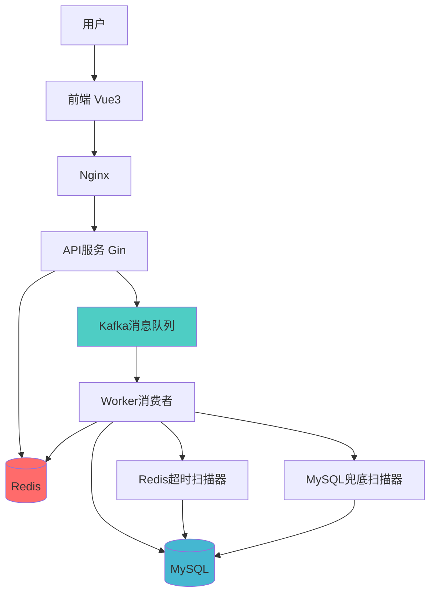
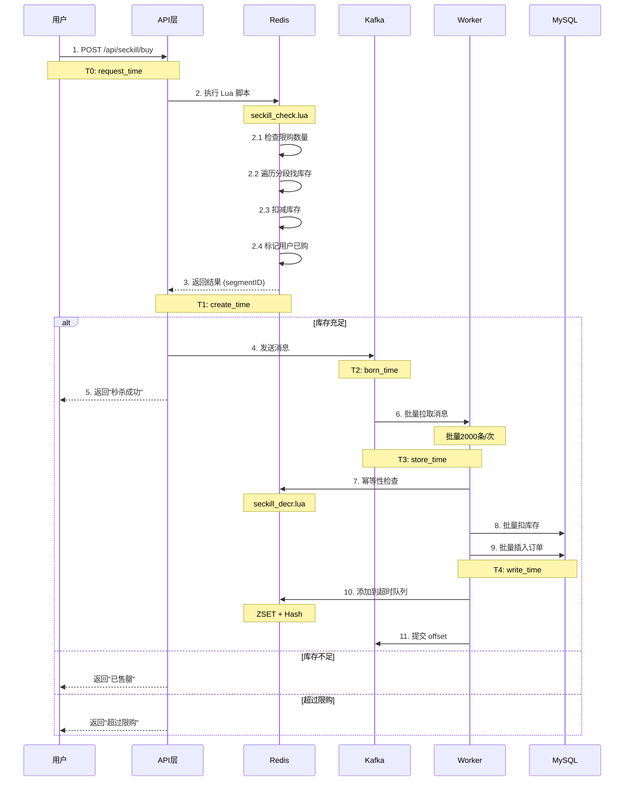
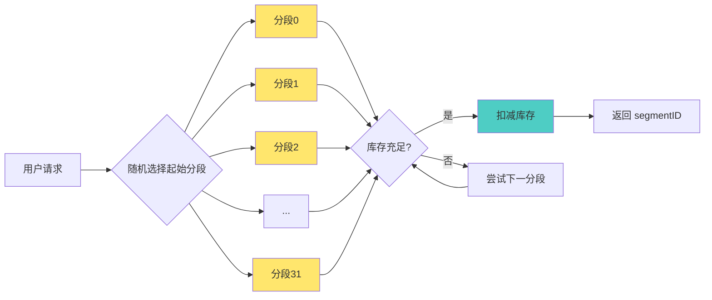
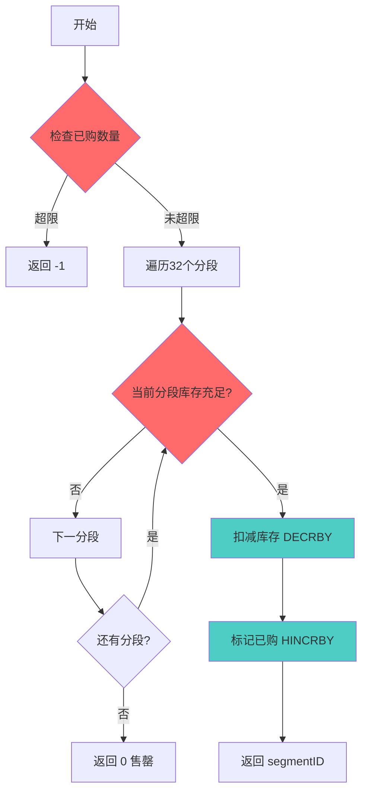
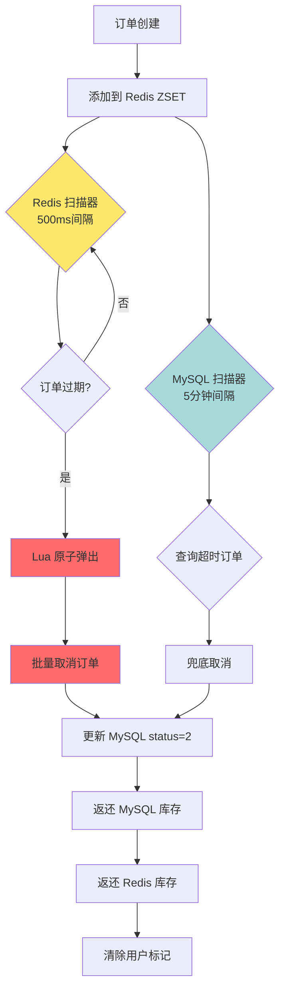
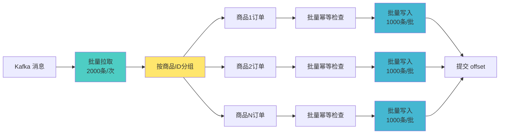
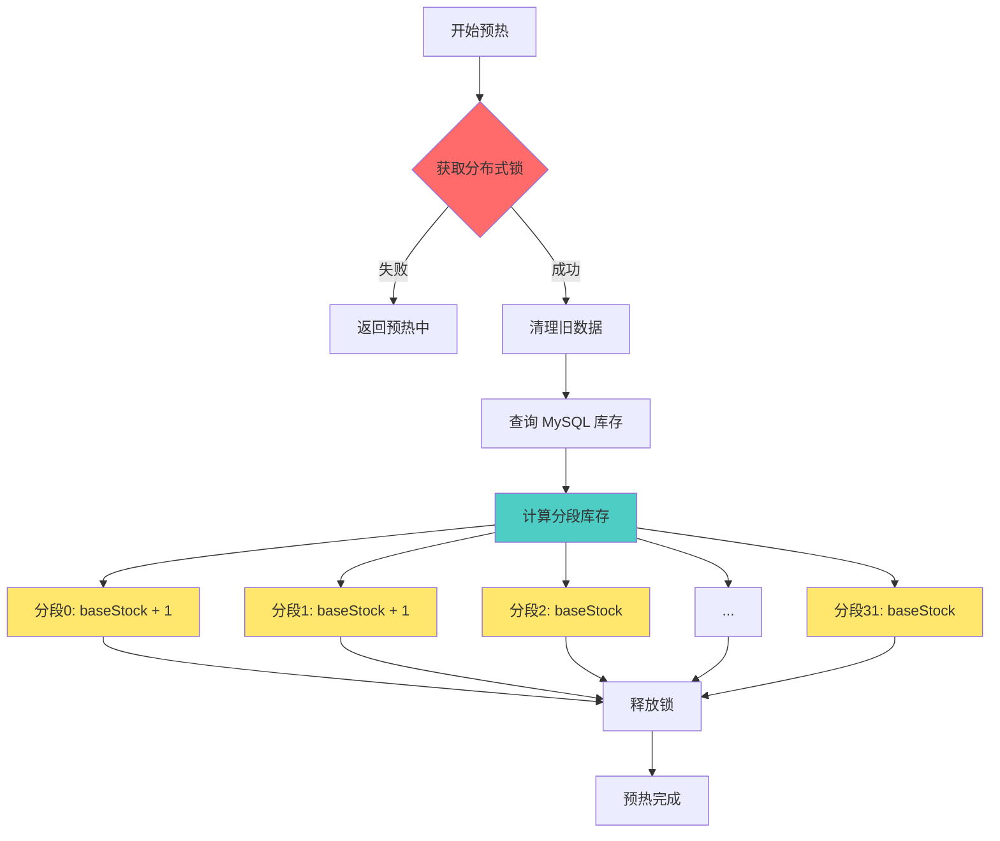
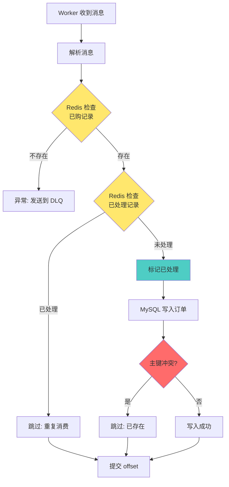
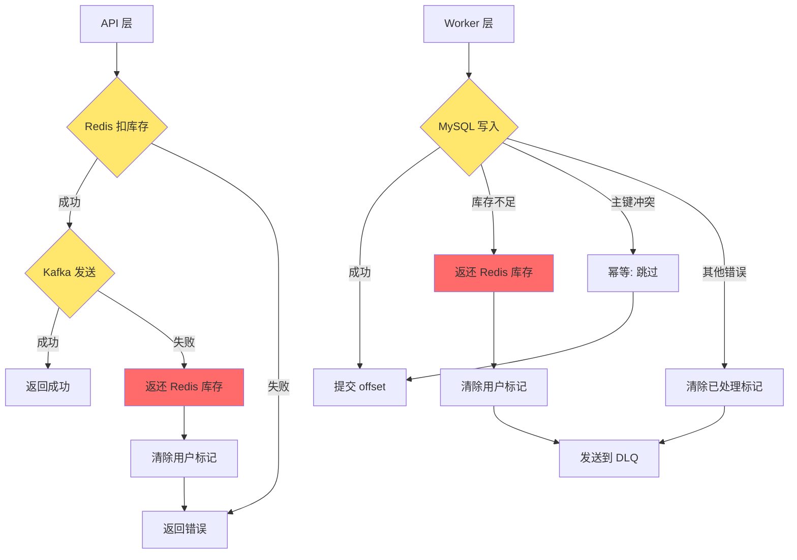
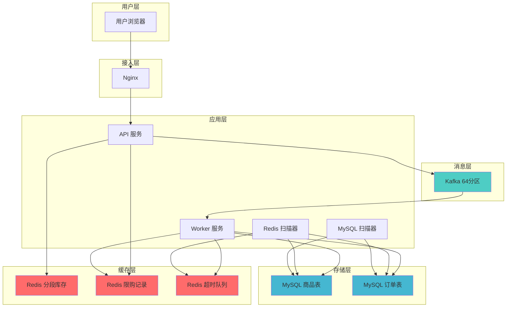

# 秒杀系统流程图

## 1. 整体架构流程

## 2. 秒杀核心流程（详细）

## 3. 库存分段流程

## 4. Lua 脚本原子操作

## 5. 订单超时取消流程

## 6. 批量处理流程

## 7. 库存预热流程

## 8. 幂等性保证流程

## 9. 容错处理流程

## 10. 完整数据流

## 时间线说明

| 时间点 | 名称 | 说明 | 典型耗时 |
|--------|------|------|----------|
| T0 | request_time | 用户点击秒杀 | 0ms |
| T1 | create_time | Redis 确认成功 | ~30ms |
| T2 | born_time | Kafka Producer 发送 | ~35ms |
| T3 | store_time | Kafka Broker 存储 | ~40ms |
| T4 | write_time | MySQL 写入完成 | ~80ms |

**订单落库 延迟**: T4 - T0 ≈ 80ms (P50)
